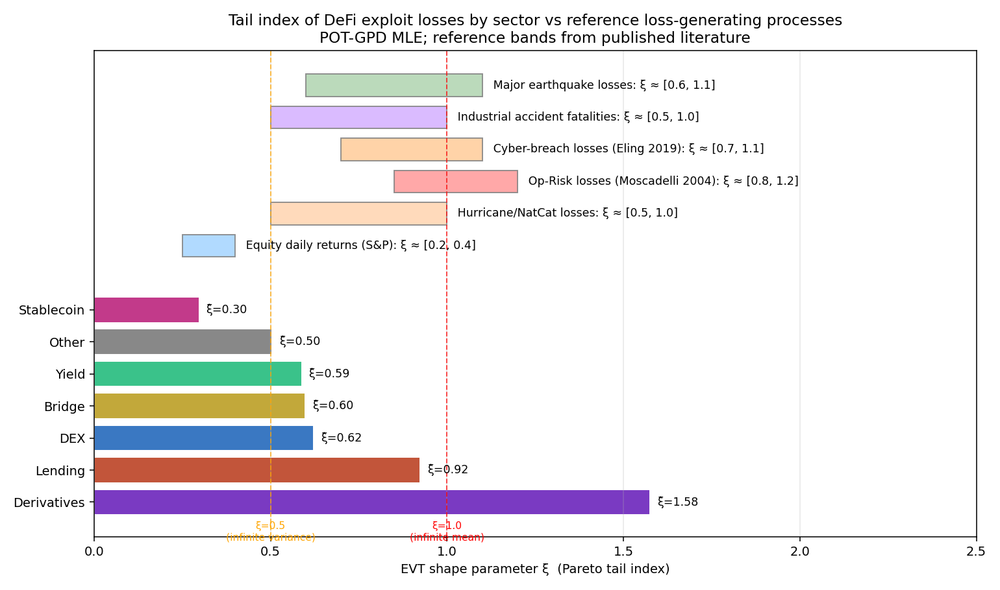

# Pareto Pools and Omori Aftershocks: Operational-Risk Capital Requirements for DeFi, Sector by Sector

*Short-form summary of the working paper
[paper.pdf](paper.pdf) ([source](paper.tex)) — fits a LinkedIn post or
an X long-form article.*

---

Banks hold regulatory capital against operational-risk losses; DeFi
protocols hold safety-module reserves and stability pools against
the same kind of losses. Aave's Umbrella safety module, Liquity's
stability pool, MakerDAO's surplus buffer, Compound's reserve
factor — these are governance-owned on-chain reserves whose explicit
purpose is to absorb external attacks, internal-fraud rugpulls,
oracle manipulation, and configuration errors before they impair
user deposits. The question this paper takes seriously is **how big
those reserves should be**, sector by sector, on the same
statistical basis a bank supervisor would apply.

We consolidate 6 years of DeFi operational-risk event data from
**seven** public sources (DefiLlama, rekt.news, kismp123
*DeFi-Security-Incident*, SunWeb3Sec *DeFiHackLabs*, BlockSec's
**Security Incidents Library**, **de.fi/rekt-database**, and
**SlowMist Hacked**) into a single deduplicated dataset of
**1,495 OpRisk events** over 2020–2026 with **USD 11.13 B** of
gross losses, and run them through the standard operational-risk
toolkit that banking regulators, cyber-insurance actuaries, and
seismologists use.

**1. The severity tail is bank-OpRisk-shaped.**
The fitted EVT shape parameter ξ̂ sits in [1.06, 1.25] across
thresholds at the pooled level — statistically indistinguishable
from Moscadelli's (2004) Basel II operational-risk range
([0.85, 1.20]) and slightly heavier than published cyber-breach
tails (Eling & Wirfs 2019). DeFi-Lending alone fits ξ̂=0.98 right
at the infinite-mean boundary; Bridge, DEX, and Yield fit
ξ̂ ≈ 0.56–0.60 in the moderate-OpRisk range.

**2. OpRisk events have aftershocks, like earthquakes.**
A univariate exponential Hawkes process fits event timing on the
stationary 2021–2026 subset with a branching ratio of **0.56** and
a **22-day half-life**. Each event raises the conditional intensity
for the next event for ≈6 weeks. These are the Omori–Utsu
parameters of seismology — Helmstetter & Sornette (2002) report
identical ranges for major active fault systems. The causal
mechanism is cross-protocol composability: an exploit in protocol
A changes the on-chain conditions that make protocol B exploitable.

**3. Per-sector capital requirements.**
Combining the per-sector severity tail with the per-sector annual
event rate, a compound Poisson–GPD LDA produces these
operational-risk capital numbers (bps of trailing-365d sector TVL):

| Sector | n | ξ̂ | TVL | VaR₉₉ | **ES₉₉** |
|---|---|---|---|---|---|
| Lending | 193 | 0.98 | USD 104 B | 633 bps | **6,153 bps** (≈USD 64 B) |
| Bridge | 95 | 0.60 | USD 50 B | 1,002 bps | **2,249 bps** (≈USD 11 B) |
| DEX | 274 | 0.59 | USD 15 B | 852 bps | **1,905 bps** (≈USD 2.9 B) |
| Yield | 177 | 0.56 | USD 12 B | 876 bps | **1,682 bps** (≈USD 2.1 B) |

**Bridge, DEX, and Yield** ES₉₉ sit in the 17–22%-of-TVL band —
broadly comparable to bank Tier-1 OpRisk capital ratios
(8–15% of risk-weighted assets) once one adjusts for the narrower
scope of DeFi operational risk vs a universal bank's full loss
universe. **Lending** is the outlier: ξ̂=0.98 and historical
nine-figure events (Vires Finance, Euler V1, BonqDAO, CREAM) push
the ES₉₉ to ≈62% of supplied TVL.

**Why it matters.** Read against existing on-chain reserves —
Aave's Umbrella safety module (~USD 100–500 m), MakerDAO's surplus
buffer (USD 250 m), Compound's market reserves — current DeFi
safety capital is, on this estimate, **two orders of magnitude
short of the 99%-confidence one-year tail in Lending specifically**,
and a single-digit multiple short in the mid-cap sectors. The
numbers give protocol teams, depositors, and supervisors a
quantitative reference for the adequacy of DeFi capital
infrastructure.

Full paper (27 pages, 10 figures, ~35 references): [paper.pdf](paper.pdf).
